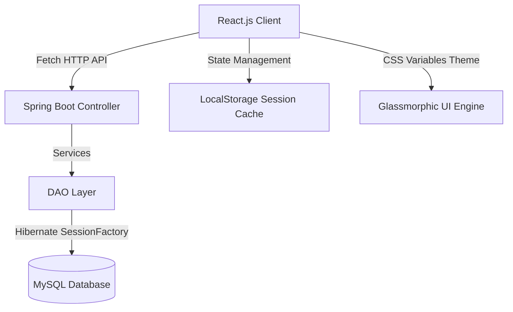

# 🚀 SamsTrack - Student Attendance Management System

SamsTrack is a high-fidelity, end-to-end web platform designed to streamline student registries, curriculum administration, and class attendance tracking. The application comprises a robust Java Spring Boot backend and an elegant, modern React.js frontend styled with a premium dark-glassmorphism theme.

---

## 🌟 Key Features

* **⚡ Real-time Roll Call Registry:** Take class attendance instantly using customized interactive toggle switches (ABSENT / PRESENT) with "Select All" capabilities.
* **📊 Analytics Dashboard:** Faculty and Administrators can view key statistics (Total Students, Courses, Active Logs) and a feed of recent attendance activity.
* **🔒 Role-Based Access Control:** Separate workflows for Faculty (Take Attendance, View Registry) and Administrators (Manage Student Registry, Subjects, and User Accounts).
* **📚 Subject & Curriculum Management:** Configure subjects in the course directory and dynamically query attendance history filtered by specific subjects and dates.
* **💾 Robust Session Management:** Patched Hibernate session factory handlers preventing database connection pool exhaustion.

---

## 🛠️ Architecture & Technology Choices



### Frontend Stack
* **Vite + React.js:** A lightning-fast building environment and responsive UI components.
* **Vanilla CSS (Variables + Flexbox/Grid):** Full stylistic control, custom scrollbars, glowing border effects, and responsive layout adapters.
* **Custom SVG Icons:** Lightweight, crisp, and high-performance inline vectors.

### Backend Stack
* **Spring Boot 2.5.6 Web Starter:** Clean REST controllers with standard request/response models.
* **Spring Data JPA & Hibernate 5.4:** Object-Relational Mapping (ORM) via explicit, highly optimized DAO layers.
* **HikariCP Database Connection Pool:** Optimized database connection pooling.
* **MySQL Database:** Secure relational storage configured for automatic schema updates (`ddl-auto=update`).

---

## 🚀 Setup & Execution Guide

### Prerequisite Configuration
Ensure you have **MySQL** running locally with a database named `batch227`.
Update connection credentials in `src/main/resources/application.properties` if needed:
```properties
spring.datasource.url=jdbc:mysql://localhost:3306/batch227?createDatabaseIfNotExist=true
spring.datasource.username=root
spring.datasource.password=root
```

### 1. Starting the Backend Server
Navigate to the backend directory `backend` and run:
```bash
./mvnw spring-boot:run
```
The server will start listening at: **`http://localhost:8080/`**

### 2. Starting the Frontend Server
Navigate to the frontend directory `frontend` and run:
```bash
npm install
npm run dev
```
The client will start listening at: **`http://localhost:4200/`** (port 4200 is bound to match the backend CORS policy).

---

## 📋 API Route Reference

### 👤 Authentication & Users
* `POST /user/register-user` - Register a new Administrator or Faculty member.
* `POST /user/login-user` - Authenticate credentials and retrieve role profile.
* `GET /user/get-all-user` - Retrieve all registered accounts.
* `DELETE /user/delete-user-by-username?username=...` - Delete a user account.

### 👤 Student Profiles
* `GET /student/get-all-students` - List all active student profiles.
* `POST /student/add-student` - Register a new student.
* `PUT /student/update-student` - Update student profile details (Name, Email).
* `DELETE /student/delete-student/{id}` - Delete student registry file.

### 📚 Course Subjects
* `GET /subject/get-all-subjects` - List all subjects in curriculum.
* `POST /subject/add-subject` - Add a new subject.
* `PUT /subject/update-subject` - Modify subject details.
* `DELETE /subject/delete-subject/{id}` - Remove a subject.

### 📅 Attendance Records
* `POST /attendance/take-attendance` - Submit a new class roll-call log.
* `GET /attendance/get-all-attendance-records` - Fetch historic roll-call listings.
* `GET /attendance/get-attendance-by-date-subjet/{date}/{subjectId}` - Retrieve records filtered by date & subject.
